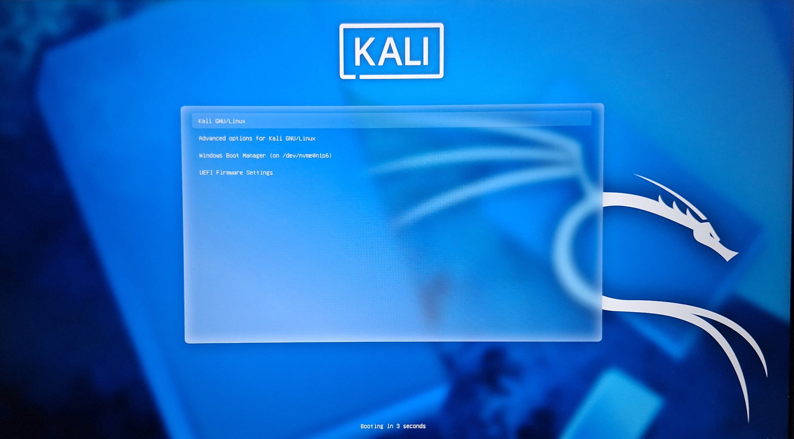

## Dual Boot Proof

### Boot Menu

### Linux Desktop

### Terminal System Info

### Basic Linux Commands

## Basic Linux Commands I Used

1. pwd  
This command shows the current working directory.

2. ls  
Lists all files and folders in the current directory.

3. cd  
Used to change directory.

4. mkdir  
Creates a new folder.

5. touch  
Creates a new empty file.

6. rm  
Deletes a file.

7. rmdir  
Deletes an empty folder.

## My Learning Notes

- Linux is different from Windows because it is command-line based.
- Linux is case-sensitive.
- Everything in Linux is treated as a file.
- The root directory is represented by "/".
- Terminal commands are powerful and fast.
